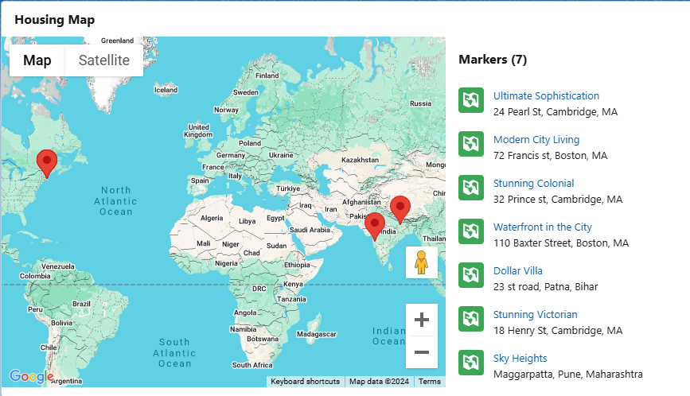
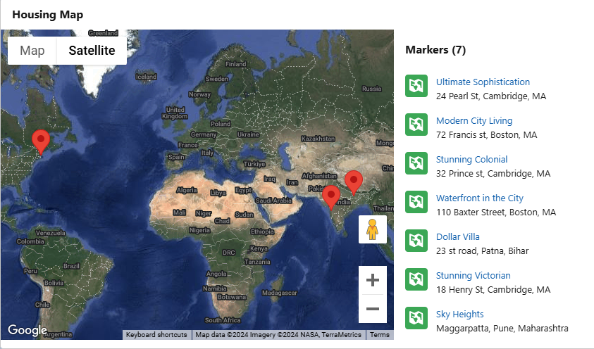

# Housing Map Project 🏠🗺️

Welcome to the **Housing Map** project! This project helps manage real estate data with a map-based solution. Built using Salesforce technologies, this project allows users to interact with housing information, view properties on a map, and access real-time data about houses available for sale or rent. 🚀

---

## Project Overview 🌍
This project provides:
- Real-time display of housing listings using **Map** and **Satellite** views.
- **Interactive map** features that allow users to view properties on a dynamic interface.
- **Salesforce integration** to manage house data and automate business processes.

---

## Table of Contents 📚
- [Introduction](#introduction)
- [Technologies Used](#technologies-used)
- [Features](#features)
- [Installation](#installation)
- [Usage](#usage)
- [Contributing](#contributing)
- [License](#license)

---

## Introduction 📋

The **Housing Map** project is designed to help real estate businesses streamline their property management, view properties dynamically, and leverage Salesforce for customer relationship management (CRM). This project uses **Salesforce**, **Lightning Web Components (LWC)**, and **Apex** to handle data and render it effectively.

---

## Technologies Used 🛠️
- **Salesforce**: For CRM and data management.
- **Apex**: Custom business logic for managing housing data.
- **Lightning Web Components (LWC)**: For building modern UI components.
- **HTML, CSS, JavaScript**: For dynamic map interactions.
- **GitHub**: For version control and collaboration.

---

## Features ✨
- **Map View** 🌍: View properties on an interactive map.
- **Satellite View** 🛰️: Switch to a satellite map view for better visualization.
- **Real Estate Listings** 🏡: See all available houses listed on the platform with details like price, type, and location.
- **Salesforce Integration** 🔗: Automate tasks like property deal approvals, tracking, and notifications.

---
### Images
- **Map View**:
  

- **Satellite View**:
  


---

## Installation 💻
To get started with the **Housing Map** project locally, follow these steps:

1. **Clone the repository**:
    ```bash
    git clone https://github.com/KislayKashyap-hub/Housing-Map-Project.git
    ```

2. **Install dependencies**:
    Make sure to have **Salesforce DX** and related tools set up on your machine for Salesforce development.
    ```bash
    npm install
    ```

3. **Setup Salesforce Project**:
    - Authenticate to Salesforce via CLI.
    - Push the source code to your Salesforce org:
      ```bash
      sfdx force:source:push
      ```

---

## Usage 📊
After the setup:
1. You can launch the **Housing Map** UI from Salesforce.
2. Use the map view to browse available housing properties.
3. The dynamic map adjusts based on property data stored in Salesforce.

---

## Contributing 🤝
We welcome contributions! To contribute to the **Housing Map** project, follow these steps:

1. Fork the repository.
2. Create a new branch for your feature or bug fix.
3. Commit your changes.
4. Push your changes to your forked repository.
5. Create a pull request to merge your changes with the main repository.

---

## License 📜
This project is licensed under the MIT License - see the [LICENSE](LICENSE) file for details.

---

## Acknowledgements 🙏
- **Salesforce** for providing the platform.
- **OpenStreetMap** for map data (if applicable).
- **GitHub** for version control and collaboration.

---

Made with ❤️ by **Kislay Kumar**
